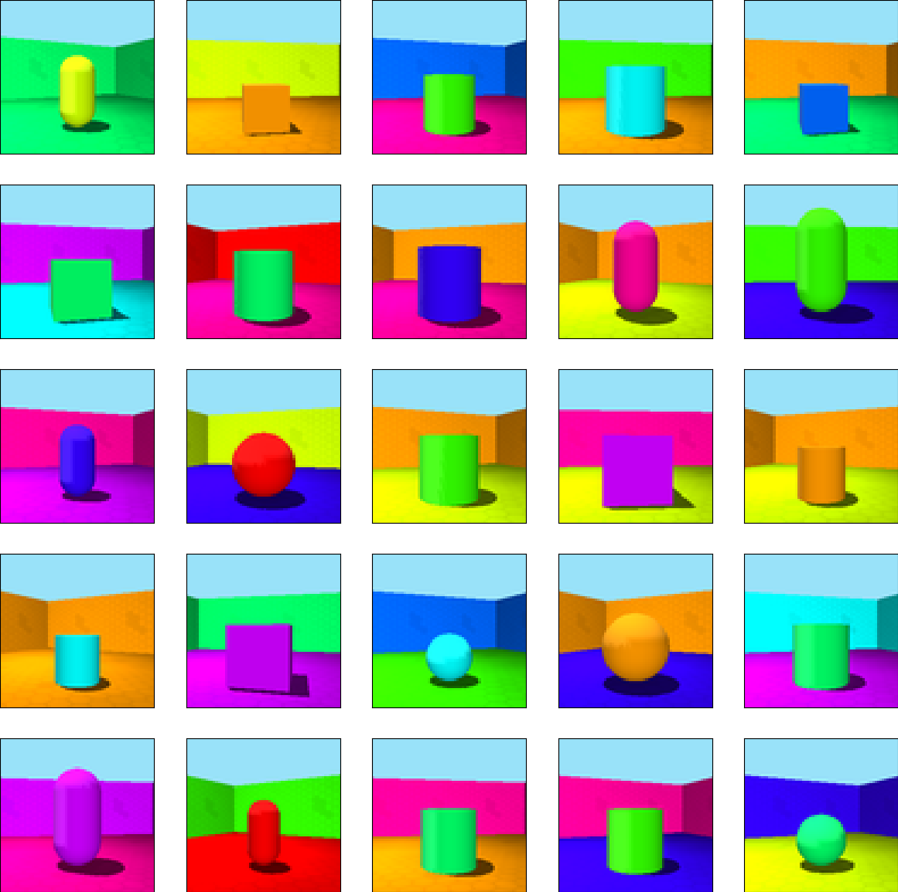
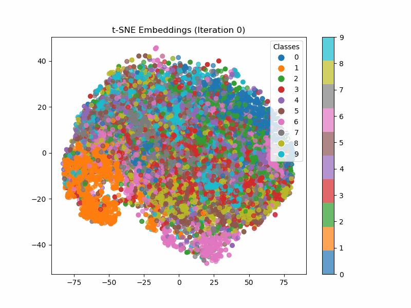

# Implementation for the Sub-Space Contrastive Representation Learning 

## Sample Images from 3DShapes



### Conditioning on  shape type generative factor and Conditioning on floor hue
<p float="left">
  
   
</p>

## TNSE Visualization of training of MNIST with Triplet and Supervised Contrastive Learning Objectives
<p float="left">


</p>
## Creating a Conda Environment from a YAML File

In this guide, we'll walk you through the process of creating a Conda environment from a YAML file. This is useful for sharing or recreating environments with specific package dependencies.

### Prerequisites

- [Conda](https://docs.conda.io/en/latest/) is installed on your system.

#### Steps

1. **Create Conda**: Open your terminal and create Conda environment.

   ```shell
   conda env create -f environment.yml
   ```

2. **Activate the New Environment**: Activate the newly created environment.
    ```shell
    conda activate subcon
    ```
3. **Verify Installation**: You can verify that the environment was created successfully by checking its list of installed packages.
    ```shell
    conda list
    ```